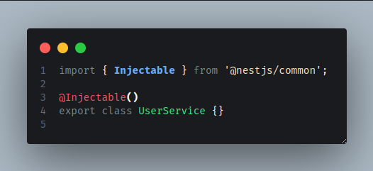
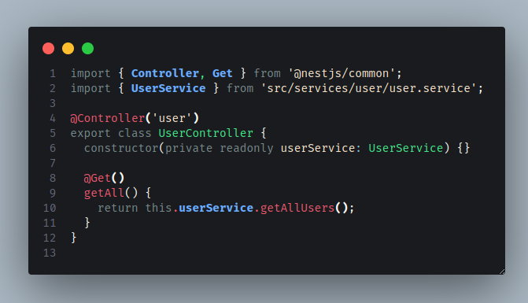

# Devden

## Descrição

Esse repositório tem por objetivo ser o backend do projeto Devden, site de conversa entre desenvolvedores de software.

O backend foi feito usando o framework [Nest.js](https://docs.nestjs.com), prevendo escalabilidade e melhor interação entre os integrantes do projeto para o desenvolvimento fluido do mesmo.

Abaixo estão algumas instruções sobre como criar novas rotas e funcionalidades no projeto, tentando manter a legibilidade e a organização de código.

## Primeiros passos

- Ter [Node](https://nodejs.org/en) instalado, na versão 20 ou +
- Ter algum gerenciador de pacotes Node instalado. Pode ser o npm, que já vem instalado com o próprio Node sem precisar fazer nada a mais. Eu particularmente prefiro [pnpm](https://pnpm.io/installation) por ser mais rápido e eficiente em espaço de disco, mas qualquer um dos dois serve.
  - Obs.: Só perceba que os comandos vão ser com **pnpm** e **npm** vai aparecer logo depois, então toma cuidado na hora de copiar e colar o código
- Por fim, com npm ou pnpm, vamos instalar globalmente a cli do nest pra poder criar depois as funcionalidades no aplicativo. Pra isso, é só rodar:

```bash
$ pnpm add -g @nestjs/cli
```

ou, caso você esteja usando npm:

```bash
$ npm install -g @nestjs/cli
```

- Recomendo também instalar o [Insomnia](https://insomnia.rest/download), que mais tarde ele vai ser útil pra quando formos criar uma funcionalidade nova ou adicionar algo no banco de dados.

## Instalação

Primeiro, você vai precisar clonar o repositório. Pode baixando ele ali em cima, dando um git clone ou ainda usando a [cli do github](https://cli.github.com/) (pra esse último precisa instalar o cli do github antes).


Quando tiver feito isso, é só

- entrar na pasta onde o projeto foi baixado no seu computador
- entrar nela pelo vs code
- abrir o terminal integrado
- digitar o seguinte comando no terminal

```bash
$ pnpm install
```

ou, se tiver usado npm:

```bash
$ npm install
```

## Rodando o aplicativo

Existem comandos prontos pra rodar o servidor de formas diferentes, mas a maioria das vezes vamos rodar com o _start_ ou _start:dev_. A diferença dos dois é que você precisa desligar e ligar de novo sempre que mudar uma coisa e o outro vai fazer isso automaticamente quando você salvar um arquivo, mas fazem a mesma coisa.

```bash
# desenvolvimento
$ pnpm run start

# watch mode
$ pnpm run start:dev

# modo de produção
$ pnpm run start:prod
```

## Criando novos arquivos

Existem 2 pastas principais no projeto, que vão ser as pastas as quais a gente vai usar mais. As pastas são **services** e **controllers**. Geralmente nós vamos criar um arquivo de Service e outro de Controller pra cada funcionalidade (ou caso de uso) da aplicação. Embaixo eu explico um pouco sobre os dois e as diferenças deles, e depois mostro um exemplo de como vamos fazer na prática.

### Controller

É o arquivo que vai ser responsável por receber e responder a requisição. Nele você vai colocar as rotas e o que elas devem responder, bem como colocar o body caso elas precisarem de um pra criar uma entrada do banco, por exemplo.

Exemplo de controller no nest:


Explicações:

- O _@Controller_ em cima da classe serve pra falar pro Nest que esse arquivo é um controller. Todos os controllers precisam ter isso em cima pra funcionarem. Dentro do parênteses a gente costuma colocar a rota que vai ser a base pra todas as outras dentro desse arquivo.
  - Pensando que esse arquivo fosse "UserController" e que seria responsável por fazer todas as coisas de usuário, a gente poderia colocar a base como _@Controller(/users)_ e todas as rotas precisariam começar com isso pra funcionar
- o _@Get_ em cima da função serve pra falar que é uma rota Get. A rota a gente coloca dentro dos parênteses do get, nesse caso da foto a rota é a raiz. Pra acessar esse recurso, então, é só rodar o servidor e entrar em "http://localhost:3000" no seu navegador que já vai estar lá funcionando.

### Service

É a parte que realmente faz as coisas. Na foto do controller dá pra ver que a função _getHello_ está chamando uma outra função que vem de um tal de _appService_. Esse appService é o responsável por dar a resposta necessária, meio que como se o controller fosse o garçom entregando uma comida e o service fosse o cozinheiro que fez a comida.

Exemplo de service no nest:


Esse dá pra ver que é só uma classe que tem a função _getHello_ e retorna uma string. Essa string é "Hello, World!".

- Do mesmo jeito que todos os controllers precisam ter o @Controller em cima da classe, os serviços precisam ter o _@Injectable_ em cima pra poderem funcionar legal.

## A parte que vai ser extremamente útil pra gente

Pra não ficar bagunçado o projeto e pra evitar erros de esquecer o @Controller ou @Injectable em cima (acontece com frequência kk), o nest oferece a possibilidade de criar os arquivos pra você!

Direto pelo terminal você consegue criar tanto um service quanto um controller e vou mostrar agora como faz.

Como eu tinha falado lá em cima, a gente tem as pastas _controllers_ e _services_ no projeto. Quando você for criar uma funcionalidade nova, você vai criar um controller E um service pra ela. A ordem não importa, pode criar qualquer um dos dois primeiros que não vai alterar nada. Vou começar mostrando como criar um controller e o nome dele vai ser _user_:

- Abra o terminal e digite:

```bash
$ nest generate controller controllers/user
```

[$\textcolor{red}{\text{Precisa ter o nest cli instalado pra isso aqui, então se você não instalou volta lá pra parte de instalação pra fazer isso}}$](#primeiros-passos)

e pronto! O controller vai estar criado dentro de controllers/user, junto com um arquivo de testes que a gente não vai usar mas é interessante deixar ele ali por enquanto.

Pra gerar um service é a mesma coisa, só trocar _controller_ por _service_ e _controllers_ por _services_:

```bash
$ nest generate service services/user
```

### Dica

Não precisa digitar o comando todo, eu escrevi ali pra todo mundo saber o que significa o comando e o que ele está fazendo, mas se digitar só a primeira letra de _generate_ ele funciona também.

A pasta e o nome do arquivo depois precisam estar completos e certinhos pra ele poder criar no lugar correto.

Exemplo com service:

```bash
$ nest g service services/user
```

## Exemplos práticos

Vou deixar um passo a passo pra ajudar na criação das rotas e das funcionalidades na prática. Uma das funcionalidades que eu tenho que fazer é a de usuários, então já aproveitei pra fazer uma parte e usar aqui de exemplo.

Primeiro, criei o controller e o service do user com o mesmo comando [daqui de cima](#a-parte-que-vai-ser-extremamente-útil-pra-gente), só que eu tirei os arquivos de teste que ele cria junto pra não ficar dando erro, porque eu acho meio chato e a gente não vai precisar deles mesmo, então dá pra só tirar, se vcs quiserem.

Depois de criar o arquivo de serviço e tirar o arquivo de teste, ficou assim na pasta:


O controller ficou a mesma coisa, mas ficou dentro da pasta _controllers_.

Dentro do arquivo _user.service.ts_, que veio vazio, eu comecei a colocar a função de listar todos os usuários pra fazer um teste e depois fiz a função de criar um novo usuário.

### Listar todos

#### Service

Ele veio assim no começo pra mim:



Daí eu criei a função de pegar todos os usuários:


O que esse trecho de código faz é basicamente chamar a função _findMany()_ dentro da tabela usuarios. O prisma é o lugar que facilita pra gente achar todas as tabelas.

Detalhe: na linha 8 tem uma palavra _async_ porque vamos mexer com o banco e, pra isso, precisamos colocar essa palavra pra avisar que em alguma parte dessa função teremos que esperar a transação com o banco começar E terminar, porque se ela sair antes não vamos conseguir terminar a transação com o banco e nada vai ser inserido.

No caso dessa função, precisamos esperar o banco buscar os usuários (então colocamos a palavra _await_ na frente da linha que vai ter que fazer a operação no banco, que é a linha 9) e nos retornar essa resposta, por isso usamos a palavra async.

Existem várias outras funções, como pegar por id, pegar só o primeiro que aparecer, criar um novo dado, excluir, alterar, etc. Nesse caso, era só chamar essa função que ela retorna todos os usuários da tabela.

#### Controller

Dentro do controller, então, a gente cria a rota e chama essa função que a gente acabou de criar no service:



O @Controller da linha 4, como já disse lá em cima, vai dizer qual é a rota "base". Quer dizer que todas as rotas desse vão começar com "/user" e daí vem o que tiver em cima dela. Caso não tiver nada, então é só "/user" mesmo.

Na linha 6 a gente cria o construtor da classe que vai ter uma variável que é do tipo _UserService_ (o em verde) que é a classe que a gente acabou de criar. A variável userService que vai ter todas as funções e vai fazer as coisas pra gente.

Na linha 8 a gente tem o decorator @Get() pra falar que a função embaixo dela é uma rota do tipo GET e, como não tem nada dentro do decorator, a rota dessa função vai ser "/user" mesmo.

Dentro da função, por fim, a gente usa a nossa variável _userService_ pra chamar a função que acabamos de criar, a _getAllUsers()_.

E pronto, a nossa rota já está feita! Pra testar, é só iniciar o server com _nest start_ e ir na url http://localhost:3000/user

Se você quiser, pode usar o [Insomnia](https://insomnia.rest/download) pra fazer essa requisição. Eu vou usar e recomendo porque depois vamos fazer rotas do tipo POST e é difícil de fazer sem um aplicativo próprio pra isso.

No Insomnia, eu faço o seguinte:

- Crio uma nova coleção
- Crio um http request do tipo GET


- Coloco a url que eu quero testar ali em cima


- Coloco o servidor pra rodar e clico em _Send_

Se tudo der certo, é pra retornar um status 200 e uma lista vazia, já que não temos nada cadastrado no servidor ainda hehe. Assim que cadastramos o primeiro, a gente volta pra esse pra tentar e ver se ele aparece aqui.

### Criar um novo usuário

Agora, usando o mesmo arquivo, vou criar uma função dentro do service para criar um usuário novo e depois criar a rota pra receber a requisição desse novo usuário.

#### Service

Assim fica o arquivo com a nova função colocada:


A maior parte do arquivo eu já expliquei, o que mudou foi da linha 9 até a linha 17. A linha 9 eu defino a função _createUser_ que recebe como parâmetro uma variável _data_ que é do tipo _Prisma.UsuariosCreateInput_. Não se preocupe com esse tipo, ele foi criado automaticamente pelo nest pra gerar erros e verificações quando alguém tentar fazer uma requisição sem passar todas as informações necessárias.

Sempre que precisar passar as informações assim pra criação de algum dado em uma tabela, o nome da classe gerada pelo nest vai ser _Prisma.[nome da tabela]CreateInput_

Seguindo pro corpo da função, a gente tem um try catch só pra garantir que o dado vai ser inserido e, caso der erro, ele mande o erro pra gente saber o que aconteceu.

Dentro do try, a gente tem a parte do código que realmente faz a inserção do novo usuário dentro do banco. Igual a parte de _getAllUsers()_, nós chamamos nossa variável _prisma_, dentro da tabela _usuarios_ e pedimos a função _create_ dessa vez, já que vamos criar um usuário.

Como vamos passar dados, precisamos mandar os argumentos pra essa função. Pra isso, abrimos chaves e passamos nossa variável _data_, que recebemos como parâmetro ali em cima.

Vamos agora para o controller criar a rota

#### Controller

O controller com a rota nova fica assim:


As coisas novas estão na interface na linha 4 até a linha 9 e na rota da linha 21.

Começando pela rota, passamos o decorator @Post() pra dizer que é uma rota do tipo POST e dentro dela colocamos "/new", o que significa que pra acessar ela precisamos entrar na url "user/new", pois "user" é a rota base.

Depois, temos a função que cria a rota em si e passamos dentro dela os parâmetros "@Body() user: User" pra dizer que vamos receber uma requisição com um body e nesse body vamos ter uma variável user, que é do tipo User. Esse tipo é a interface que está na linha 4 até a linha 9. Então, estamos dizendo que a variável user tem os atributos USR_NAME, USR_SENHA...

Por fim, dentro da função mesmo nós chamamos a função de criar usuário de dentro do serviço que criamos agora há pouco. Como a nossa variável user tem os mesmos atributos da nossa tabela no banco, ele consegue fazer essa passagem.

E pronto! Se tudo der certo, conseguimos colocar um usuário novo no banco agora

Meu teste:

- Criei uma nova requisição no Insomnia do tipo post e passe a url que quero testar (http://localhost:3000/user/new)
- Criei um corpo pra requisição que vai ser o usuário a ser inserido:

```json
{
  "USR_NAME": "Felipe",
  "USR_SENHA": "123",
  "USR_EMAIL": "email@email.com",
  "USR_NOME_COMPLETO": "Felipe de Andrade",
  "USR_STAFF": 1
}
```

- Iniciei o server e cliquei em Send pra criar o usuário novo

Resultado:


Aparentemente está tudo certo. Tivemos um retorno 201, que significa que foi criado, e nenhum erro foi retornado no body.

Vamos ver agora se aparece algo no nosso banco usando a rota de "getAllUsers":


Deu certo!

Se quiser, pode testar criando mais alguns usuários e pegando eles depois na rota, ou até conferindo no MySQL Workbench pra ver se estão lá mesmo hehe.

Enfim, esse é o basicão da criação de rotas e de serviços.

## Possíveis erros que podem dar no começo

- Não vai conectar com o banco de dados na primeira vez que você rodar. Pra ele rodar, eu preciso te passar um arquivo com a url do banco de dados. Não passei aqui porque o meu MySQL não tem senha, talvez o de vocês tenha, daí dessa forma fica mais fácil de gerenciar isso. Quando for rodar, me manda uma mensagem que mando o arquivo e ajudo a alterar a url pra ele conseguir conectar com o banco certinho.

- Muito cuidado quando você errar o nome de algum arquivo na criação de um serviço ou de um controller. Se você errar e escrever "nest g controller control/user" e quiser apagar pra refazer, vai ter que apagar dentro do arquivo **app.module.ts**. Mas cuidado porque se vocẽ apagar algum outro módulo o server vai dar erro e parar de funcionar, provavelmente.

  - Pode me chamar pra ajudar a arrumar, se vc tiver alguma dúvida

- As rotas não retornam ou então não criam nada. Pode ser que você esqueceu de colocar o async e o await, daí a função retorna sem esperar a resposta do banco. Geralmente isso faz ele retornar uma lista vazia ou não criar nada no banco.

## Dúvidas

É isso, qualquer dúvida pode me chamar no whatsapp ou no discord que eu ajudo a criar os arquivos.

<!-- ## Test

```bash
# unit tests
$ pnpm run test

# e2e tests
$ pnpm run test:e2e

# test coverage
$ pnpm run test:cov
``` -->
